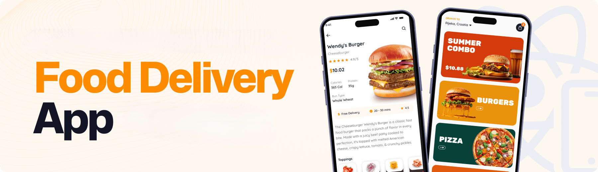
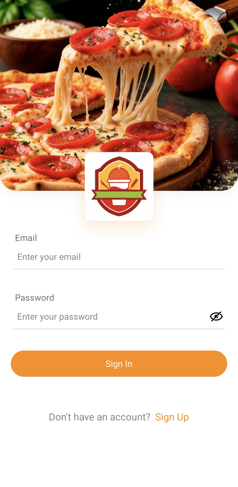
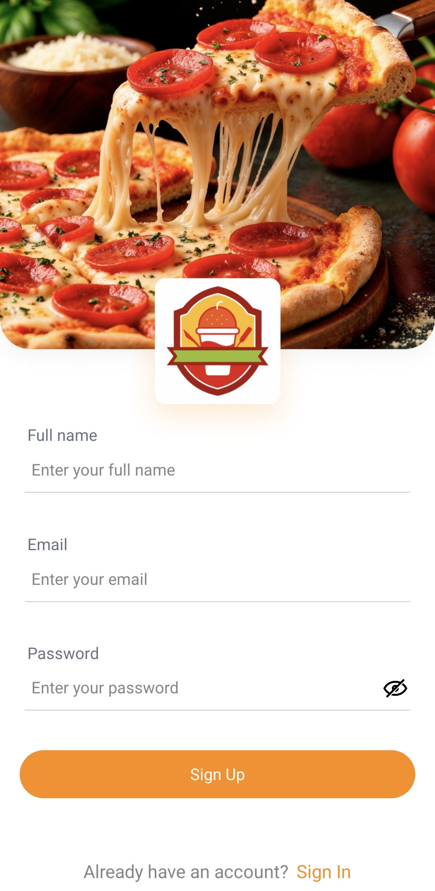
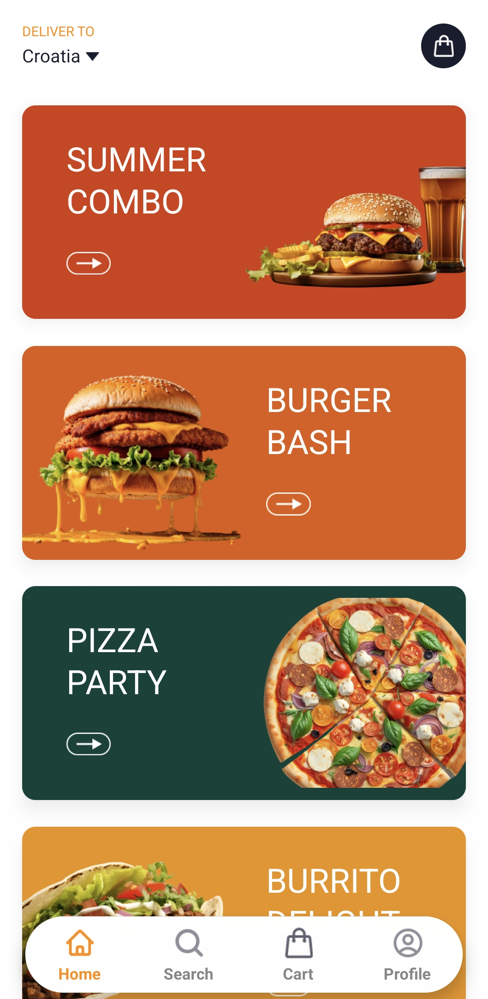

<div align="center">
   

  <div>
    
    
        
    
    
  </div>

  <h3 align="center">Foodi Food Delivery Mobile App</h3>
    <div align="center">
      
      
      
    </div>
</div>

## 📋 <a name="table">Table of Contents</a>

1. 🤖 [Introduction](#introduction)
2. ⚙️ [Tech Stack](#tech-stack)
3. 🔋 [Features](#features)
4. 🤸 [Quick Start](#quick-start)

## <a name="introduction">🤖 Introduction</a>

Built with React Native, TypeScript, and Tailwind CSS, this full-stack Food Delivery app features Google Authentication, dynamic search and filters, cart functionality, and smooth navigation. Powered by Appwrite for backend, database, and file storage, it delivers a responsive, scalable, and intuitive user experience with modern UI/UX best practices.

## <a name="tech-stack">⚙️ Tech Stack</a>

- **[Appwrite](https://jsm.dev/rn-food-appwrite)** is an open-source backend-as-a-service platform offering secure authentication (email/password, OAuth, SMS, magic links), databases, file storage with compression/encryption, real-time messaging, serverless functions, and static site hosting via Appwrite Sites—all managed through a unified console and microservices architecture.

- **[Expo](https://expo.dev/)** is an open-source platform for building universal native apps (Android, iOS, web) using JavaScript/TypeScript and React Native. It features file-based routing via Expo Router, fast refresh, native modules for camera/maps/notifications, over-the-air updates (EAS), and streamlined app deployment.

- **[NativeWind](https://www.nativewind.dev/)** brings Tailwind CSS to React Native and Expo, allowing you to style mobile components using utility-first classes for fast, consistent, and responsive UI design.

- **[React Native](https://reactnative.dev/)** is a framework for building mobile UIs with React. It enables component‑based, cross-platform development with declarative UI, deep native API support, and is tightly integrated with Expo for navigation and native capabilities.

- **[Tailwind CSS](https://tailwindcss.com/)** is a utility-first CSS framework enabling rapid UI design via low-level classes. In React Native/Expo, it’s commonly used with NativeWind to apply Tailwind-style utilities to mobile components.

- **[TypeScript](https://www.typescriptlang.org/)** is a statically-typed superset of JavaScript providing type annotations, interfaces, enums, generics, and enhanced tooling. It improves error detection, code quality, and scalability—ideal for robust, maintainable projects.

- **[Zustand](https://github.com/pmndrs/zustand)** is a minimal, hook-based state management library for React and React Native. It lets you manage global state with zero boilerplate, no context providers, and excellent performance through selective state subscriptions.

- **[Sentry](https://jsm.dev/rn-food-sentry)** is a powerful error tracking and performance monitoring tool for React Native apps. It helps you detect, diagnose, and fix issues in real-time to improve app stability and user experience.

## <a name="features">🔋 Features</a>

### Features of the Mobile Movie AppProject

👉 **Google Authentication**: Secure and seamless user sign-ins using Google.

👉 **Home Page**: Showcases the latest offers and directs users to filtered search results.

👉 **Search Page**: Lets users explore all foods with category filters and keyword search.

👉 **Product Details Page**: Displays food images, key details, and allows adding items to the cart.

👉 **Cart Page**: Review selected items and see the total price.

👉 **Profile Page**: Manage user settings and preferences.

👉 **Appwrite Integration**: Handles backend database and file storage for food items.

and many more, including code architecture and reusability.

## <a name="quick-start">🤸 Quick Start</a>

**Installation**

Install the project dependencies using npm:

```bash
npm install
```

**Set Up Environment Variables**

Create a new file named `.env` in the root of your project and add the following content:

```env
EXPO_PUBLIC_APPWRITE_PROJECT_ID=
EXPO_PUBLIC_APPWRITE_ENDPOINT=
EXPO_PUBLIC_APPWRITE_PLATFORM_ID=
EXPO_PUBLIC_APPWRITE_DATABASE_ID=
EXPO_PUBLIC_APPWRITE_USER_COLLECTION_ID=
EXPO_PUBLIC_APPWRITE_CATEGORIES_COLLECTION_ID=
EXPO_PUBLIC_APPWRITE_MENU_COLLECTION_ID=
EXPO_PUBLIC_APPWRITE_CUSTOMIZATIONS_COLLECTION_ID=
EXPO_PUBLIC_APPWRITE_MENU_CUSTOMIZATIONS_COLLECTION_ID=
EXPO_PUBLIC_APPWRITE_BUCKET_ID=

```

Replace the placeholder values with your actual credentials by signing up on the **[Appwrite](https://jsm.dev/rn-food-appwrite)** dashboard.

**Running the Project**

```bash
npx expo start
```

Open your ExpoGO app on your phone and scan the QR code to view the project.
